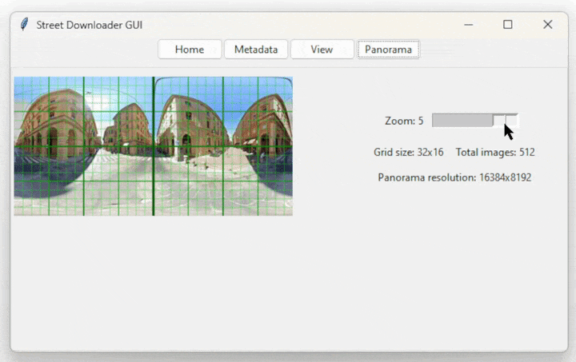

# streetdownloader

## Introduction

streetdownloader is a Python package that uses the
Google Street View API to download panoramic images.
It allows the user to download both full panoramic images via scraping
and various parts of the panorama in perspective distortion via the API.

## Requirements

To run this package, you will need to create a `.env` file
and insert a `GOOGLE_API_KEY` obtained through the Google Cloud Platform
at https://developers.google.com/maps/documentation/streetview/get-api-key .
A signature in `GOOGLE_API_SIGNATURE` is needed for over 25'000 requests per day.

Please note that downloading panoramic images is free,
while downloading images in perspective distortion (views)
may incur a cost of $0.10 per location, as 14 images are downloaded per location.
More information can be found at https://developers.google.com/maps/documentation/streetview/usage-and-billing

This package was developed and tested using Python 3.10,
but it should be compatible with Python 3.9 and later versions.

The package's dependencies can be installed using either
`pip install -r requirements.txt` or `poetry install`.

The package is not indexed on PyPI yet as I may change the package name.

## GUI Usage

Execute the `gui.py` file or run

```python
from streetdownloader import StreetDownloaderGUI

StreetDownloaderGUI().run()
```

This graphical user interface (GUI) is built using Python and the Tkinter library
in order to facilitate the process of downloading images from Google Street View.
The interface is divided into two main parts: the header and the body.
The header consists of four buttons that display different sections within the body.
The sections are Home, Metadata, View, Panorama.


The Home section allows users to
select the folder where the images will be downloaded,
set the coordinates that define the rectangle of the search area,
initialize and monitor the progress of metadata download from the Google Street View API and
initialize and monitor the progress of image download, both views and panoramas.
The coordinates can also be set by pasting them from the clipboard if their format is `lat,lng` (
ex. `41.89149, 12.49073`)
or from the Google Chrome instance started with the button.


In the Metadata section, users can
set the Google API key,
select the distance between the search positions of panoramas and
choose whether to download panoramas from Google or other providers who have uploaded images to Google Street View.
The key is automatically detected if inserted into the environment variables or in a `.env` file.


In the View section, users can
select the number of headings to distribute per pitch and
choose whether to crop the Google logo at the bottom of the image.


In the Panorama section, users can only choose the zoom level for the download of the panorama.



## Package usage

The package has the following functions:

### download_panoramas

`download_panoramas(folder: StrOrBytesPath, loc1: Location, loc2: Location)`

This function downloads all the panoramic images
in the area defined by the two locations provided.
The images will be saved to the specified path
and named with the id of the panorama.

Location is a named tuple containing latitude and longitude.
A tuple of two floats can also be passed as an argument

### download_views

`download_views(folder: StrOrBytesPath, loc1: Location, loc2: Location)`

This function downloads all the images in perspective distortion
in the area defined by the two locations provided.
The images will be saved to the specified path
and named with a name that includes the panorama's ID and information
about the viewpoint, such as heading, field of view (fov), and pitch.

### user_input

`user_input()`

This function prompts the user for input
using the methods of the GUI interface.
It returns a tuple
containing the path where the images will be saved,
and the starting and ending locations of the area where the
images should be downloaded.

## Example

Using `user_input`:

```python
from streetdownloader import download_panoramas, user_input

folder, loc1, loc2 = user_input()
download_panoramas(folder, loc1, loc2)
```

Manual input:

```python
from pathlib import Path
from streetdownloader import download_panoramas, Location

folder = Path('/path/to/colosseum')
loc1 = Location(41.8914369, 12.4907346)
loc2 = Location(41.8890246, 12.4936502)
download_panoramas(folder, loc1, loc2)
```

## Note

Please be aware that the usage of the Google Street View API is subject
to their terms and conditions,
and that this package is for research purposes only.